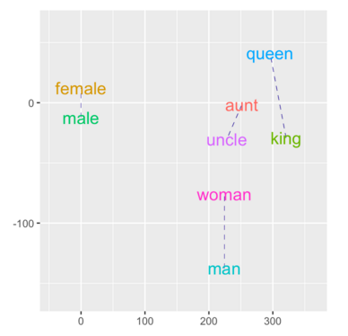
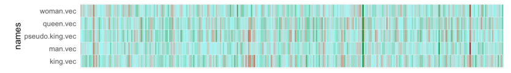

# CanonicalWordVectorExamples
Reproduces and explores some of the canonical examples of word vector analysis

Analyzes some "canonical" comparisons of words using the [GloVe word vectors](http://nlp.stanford.edu/projects/glove/).  
An example of the output of the program is published [here](http://rpubs.com/ww44ss/169782)

####THE RELATIONSHIP BETWEEN VARIOUS VECTOR REPRESENTATIONS OF WORDS

 
####IMAGES OF WORD VECTORS

###USAGE NOTES:  
To use this code, you will need to download word vectors from the Stanford website directly. The word vector files are too big to be stored on this github page, and automating the download in the program made execution time impractically long. The vectors used in this analysis are contained in [Glove.6B.zip](http://nlp.stanford.edu/data/glove.6b.zip), though I encourage exploration of other available vector sets as well.  
You will need to edit local directory references in the first lines of the program to point to your own system.  

###FILES:

__CanonicalWordVectorExamples.Rmd__: The executable RmD file producing the output above.

__*.png__: Images shown above. 

